# Solitair ERP — User Guide

This guide explains how to use each section visible in the Solitair menu: **Purchase**, **HR**, **Inventory**, and **Settings** (admin only). Screenshots were taken from the live system at [https://solitair.telldb.com](https://solitair.telldb.com).

---

## Table of contents

1. [Getting started](#1-getting-started)
2. [Dashboard (Home)](#2-dashboard-home)
3. [Purchase module](#3-purchase-module)
4. [HR module](#4-hr-module)
5. [Inventory module](#5-inventory-module)
6. [Settings (Administrators)](#6-settings-administrators)
7. [Your account](#7-your-account)
8. [Recommended workflows](#8-recommended-workflows)
9. [Permissions & access](#9-permissions--access)

---

## 1. Getting started

### Login

1. Open **https://solitair.telldb.com**
2. Enter your **username** and **password**
3. Click **Sign In**

After login you land on the **Dashboard**, which summarizes Purchase, HR, and Inventory activity.

### Main navigation

The top menu shows only the modules enabled for Solitair:

| Menu | Purpose |
|------|---------|
| **Purchase** | Vendors, requests, orders, receipts, bills, expenses |
| **HR** | Employees, departments, designations |
| **Inventory** | Items, stock, movements, stock take, reports |
| **Settings** (gear icon) | Users, roles, company, approvals — **superuser only** |

Use the **bell** icon for notifications and the **user menu** (top right) for profile and logout.

---

## 2. Dashboard (Home)

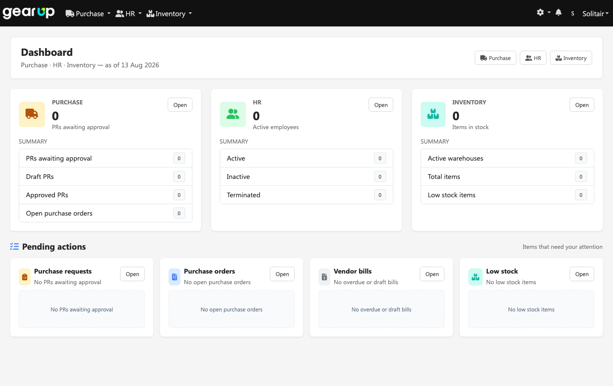

The dashboard is your home page. It shows:

- **Purchase** — PRs awaiting approval, draft/approved PRs, open POs
- **HR** — active, inactive, and terminated employee counts
- **Inventory** — warehouses, total items, low-stock alerts

### How to use it

1. Review **Pending actions** at the bottom for items needing attention (PRs, POs, bills, low stock).
2. Click **Open** on any card to jump directly to that module.
3. Use the quick links (**Purchase**, **HR**, **Inventory**) in the top-right of the dashboard header.

**Tip:** Check the dashboard at the start of each day to see approvals and stock issues.

---

## 3. Purchase module

Purchase covers the full procurement cycle: request → order → receive → bill.

### 3.1 Purchase Dashboard

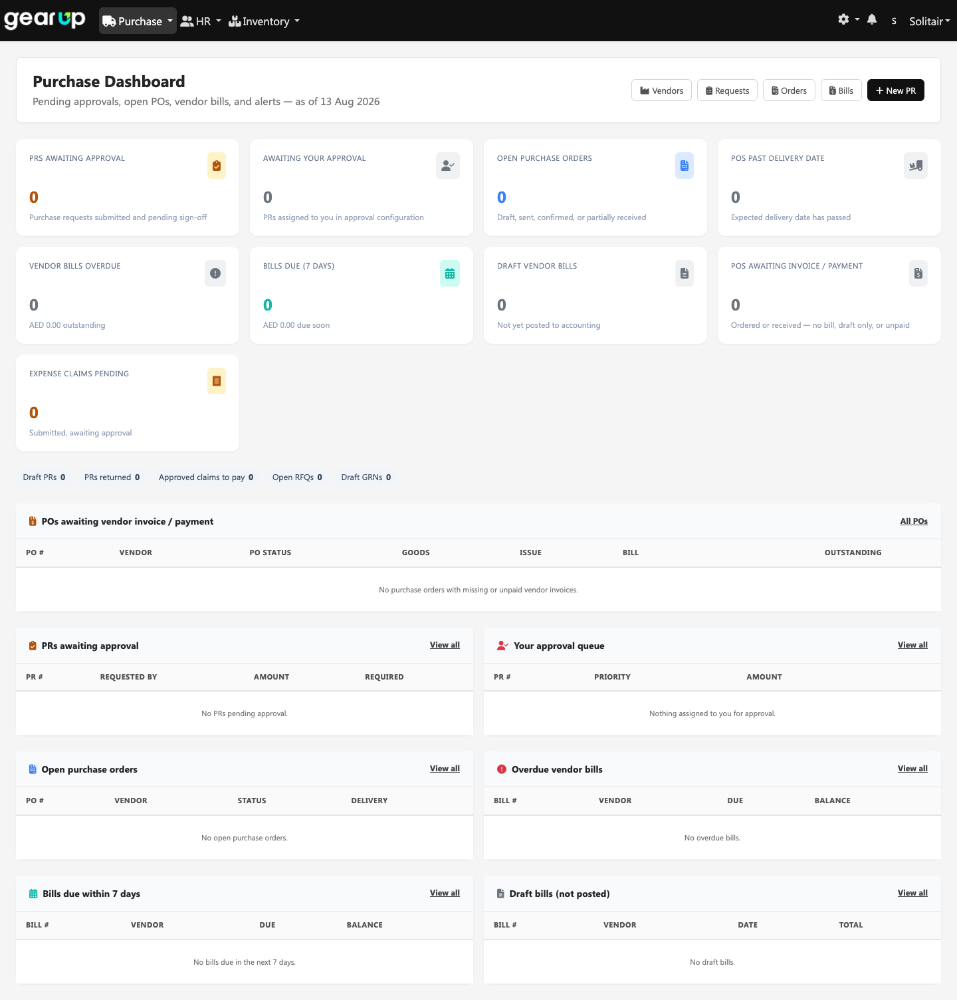

**Menu:** Purchase → Dashboard

Use this page for a procurement overview — pending PRs, POs, vendor bills, and KPIs. Open it when you need a snapshot before diving into lists.

---

### 3.2 Vendors

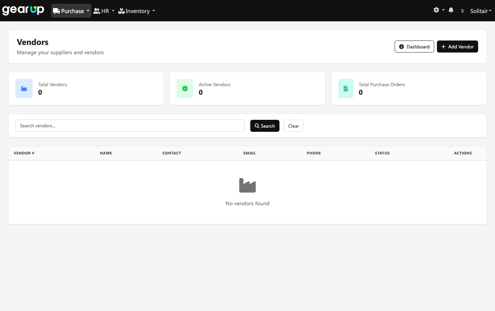

**Menu:** Purchase → Vendors  
**URL:** `/purchase/vendors/`

Maintain your supplier master data here.

#### How to add a vendor

1. Click **Add Vendor** (or the inline form toggle).
2. Fill in: vendor name, contact name, email, phone, address, status.
3. Click **Save**.

#### How to manage vendors

| Action | Steps |
|--------|-------|
| **Search** | Use the search box and click **Search** |
| **View** | Click **View** in the Actions column |
| **Edit** | Open the vendor → **Edit**, update fields → **Save** |
| **Deactivate** | Edit vendor and set status to inactive |

**Best practice:** Create vendors before raising purchase requests or POs so they can be selected in dropdowns.

---

### 3.3 Purchase Requests (PR)

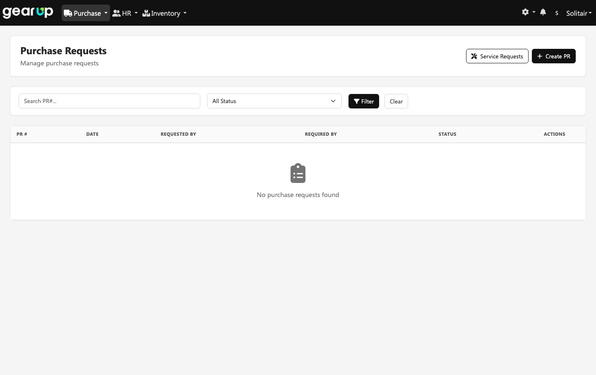

**Menu:** Purchase → Purchase Requests  
**URL:** `/purchase/requests/`

Internal requisitions before a PO is issued.

#### How to create a PR

1. Click **+ Create PR**.
2. Enter header details: required-by date, notes, etc.
3. Add **line items** — select inventory items, quantities, and estimated costs.
4. **Save** as draft or **Submit** for approval.

#### PR statuses

| Status | Meaning |
|--------|---------|
| **Draft** | Still being edited; not sent for approval |
| **Submitted / Pending** | Waiting for approver |
| **Approved** | Can be converted to a Purchase Order |
| **Rejected** | Returned to requester for correction |

#### After approval

- Open the approved PR → **Convert to PO** to create a purchase order with prefilled lines.

**Filter tip:** Use **All Status** and the search box to find PRs by number or requester.

---

### 3.4 Service Requests

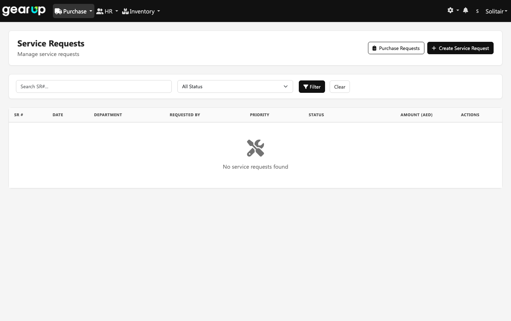

**Menu:** Purchase → Service Requests  
**URL:** `/service-request/`

For non-stock work or services (maintenance, consulting, etc.) that are not inventory items.

#### How to use

1. Click **Create** to add a new service request.
2. Describe the service, quantity/cost, and required date.
3. Submit for approval (if configured in Settings → Approval Configuration).
4. Track status in the list — filter by status as needed.

---

### 3.5 Purchase Orders (PO)

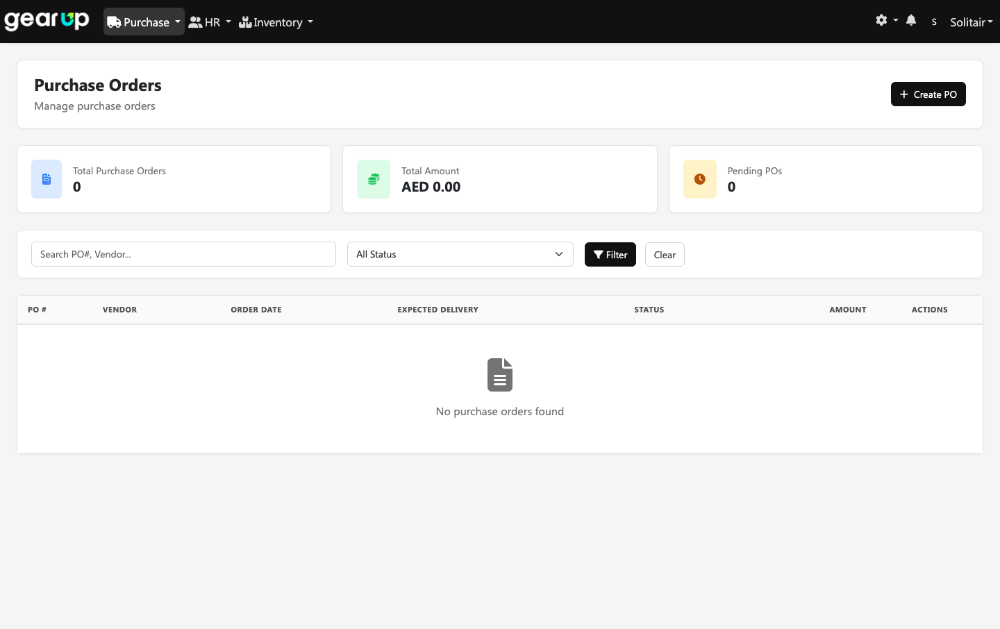

**Menu:** Purchase → Purchase Orders  
**URL:** `/purchase/orders/`

Formal orders sent to vendors.

#### How to create a PO

**Option A — From an approved PR**

1. Open the approved PR.
2. Click **Convert to PO**.
3. Confirm vendor, lines, and delivery date → **Save**.

**Option B — Direct PO**

1. Click **+ Create PO**.
2. Select **vendor**, order date, expected delivery.
3. Add line items (items, qty, unit price).
4. Save and submit for approval if required.

#### PO summary cards

- **Total Purchase Orders** — count of all POs
- **Total Amount** — combined PO value (AED)
- **Pending POs** — orders awaiting action

#### Typical PO actions

| Action | When to use |
|--------|-------------|
| **View / Edit** | Update draft PO before sending |
| **Approve** | Approver confirms the order |
| **Send to vendor** | Email/print PO to supplier |
| **Receive goods** | Create GRN when items arrive |

---

### 3.6 Goods Receipt Notes (GRN)

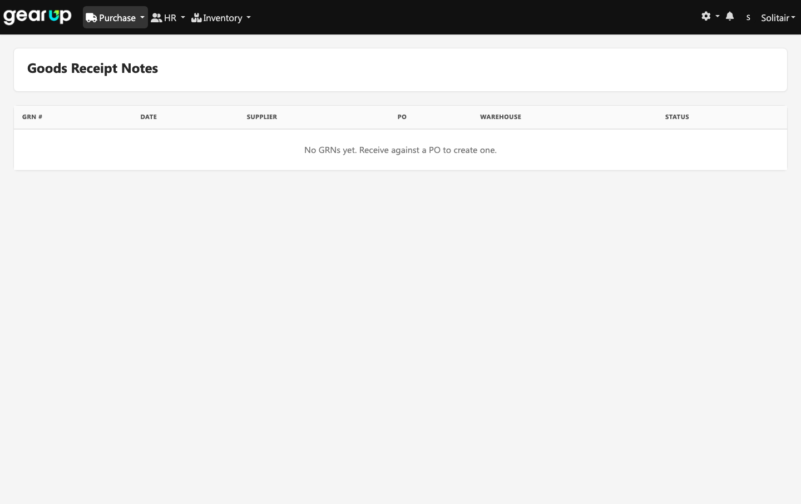

**Menu:** Purchase → Goods Receipt Notes  
**URL:** `/purchase/grn/`

Record physical receipt of goods against a PO. This updates inventory stock.

#### How to receive goods

1. Click **Create GRN** (or receive from an open PO detail page).
2. Select the **Purchase Order**.
3. Enter received quantities per line (partial receipts are supported).
4. Save/post the GRN.

**Important:** Stock levels in Inventory → Stock Levels update after GRN is posted.

---

### 3.7 RFQ / Competitive Analysis

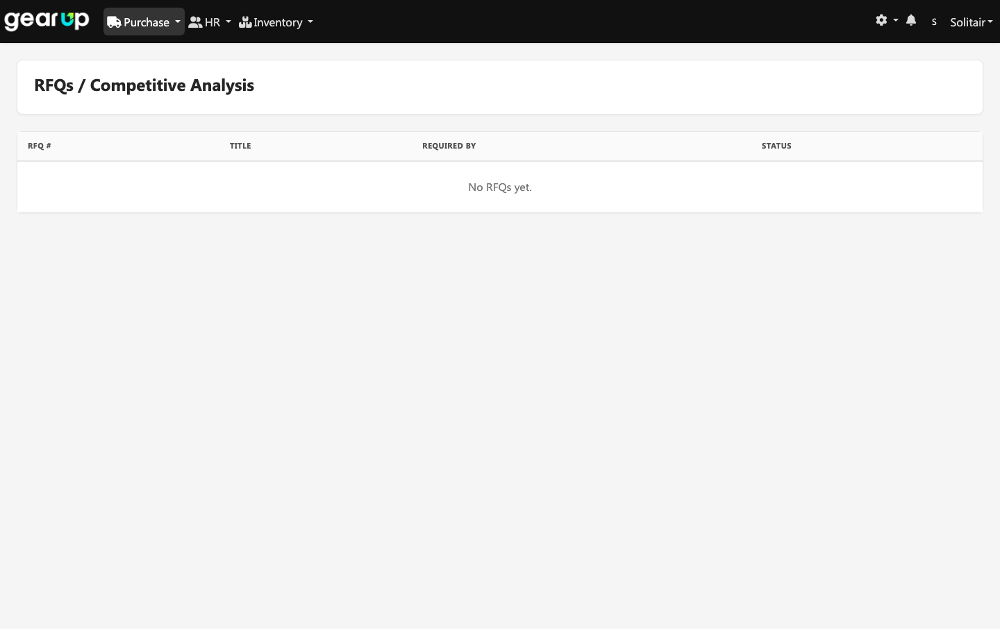

**Menu:** Purchase → RFQ / Competitive Analysis  
**URL:** `/purchase/rfq/`

Request and compare quotes from multiple vendors before awarding a PO.

#### How to use

1. Create an **RFQ** with items and quantities.
2. Attach vendor quotes or enter quote details.
3. Compare prices and terms.
4. **Award** to the selected vendor → convert to PO.

Use this when you need competitive bidding rather than a single-vendor PR.

---

### 3.8 Vendor Bills

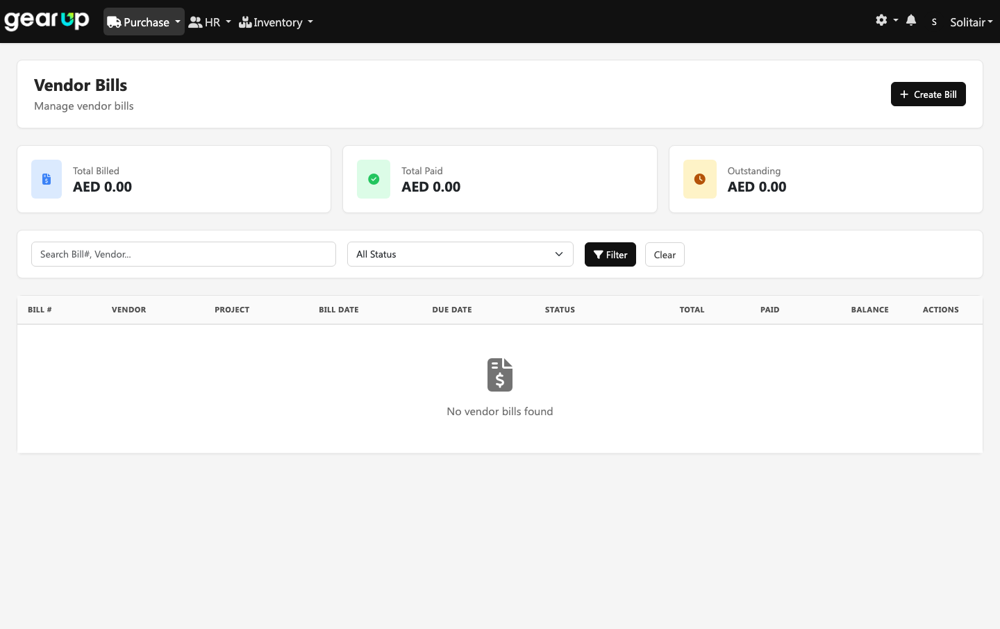

**Menu:** Purchase → Vendor Bills  
**URL:** `/purchase/bills/`

Accounts-payable invoices from vendors.

#### How to create a bill

1. Click **Create Bill**.
2. Link to a **PO** (recommended) or enter vendor manually.
3. Enter bill number, bill date, due date, line amounts, VAT if applicable.
4. Save → submit for **approval** if configured.

#### Bill workflow

```
Draft → Submitted → Approved → Paid
```

Match bill amounts to the PO and GRN before approving.

---

### 3.9 Expense Claims

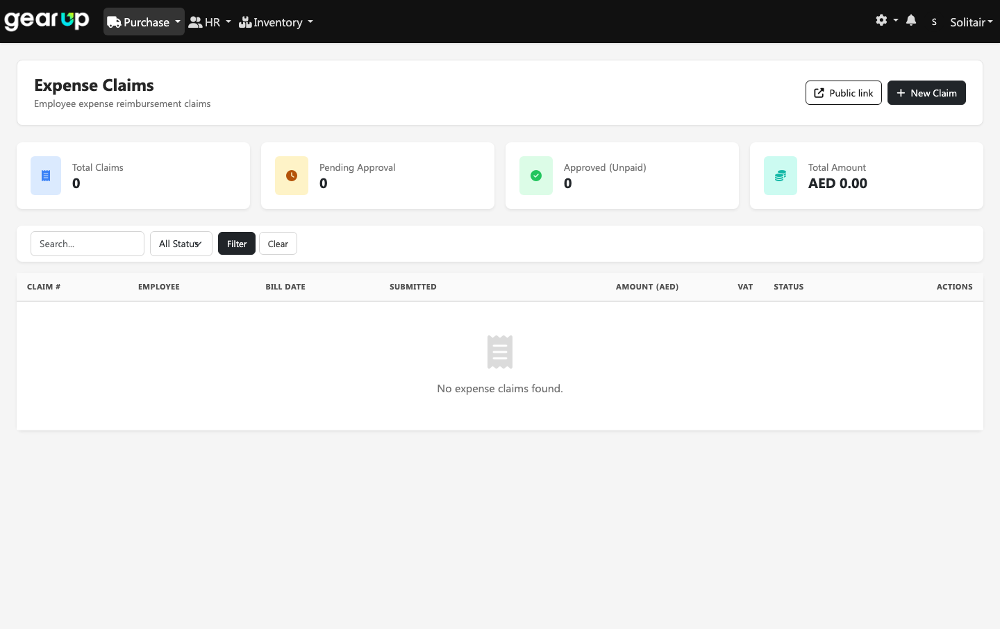

**Menu:** Purchase → Expense Claims  
**URL:** `/purchase/expense-claims/`

Employee expense reimbursements (travel, supplies, etc.).

#### How to submit a claim

1. Create a new expense claim.
2. Add line items: date, category, description, amount, receipt attachment.
3. Submit for manager approval.
4. Finance/approver reviews and approves for payment.

Attach receipts for VAT recoverable expenses.

---

### 3.10 Recurring Expenses

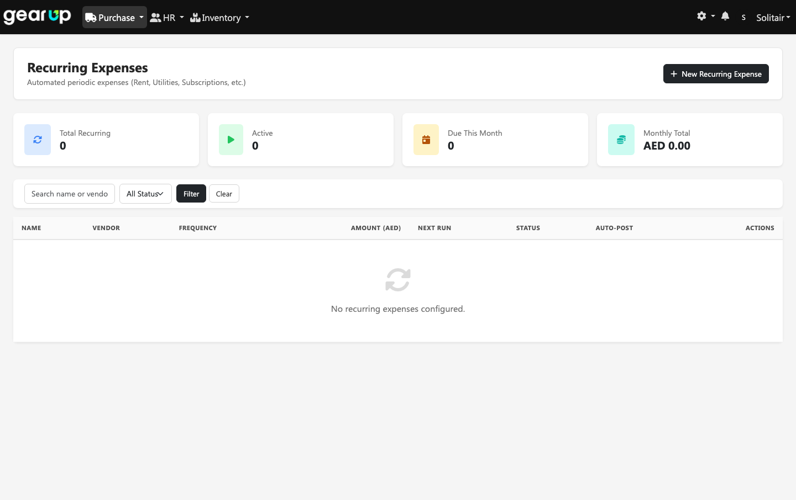

**Menu:** Purchase → Recurring Expenses  
**URL:** `/purchase/recurring-expenses/`

Set up repeating vendor expenses (rent, subscriptions, utilities).

#### How to use

1. Create a recurring expense template: vendor, amount, frequency, start date.
2. The system generates bills or reminders on schedule.
3. Review and approve generated entries like normal vendor bills.

---

## 4. HR module

In Solitair mode, HR covers **master data** only: employees, departments, and designations. Leave, payroll, and recruitment are not shown in the menu.

### 4.1 Employees

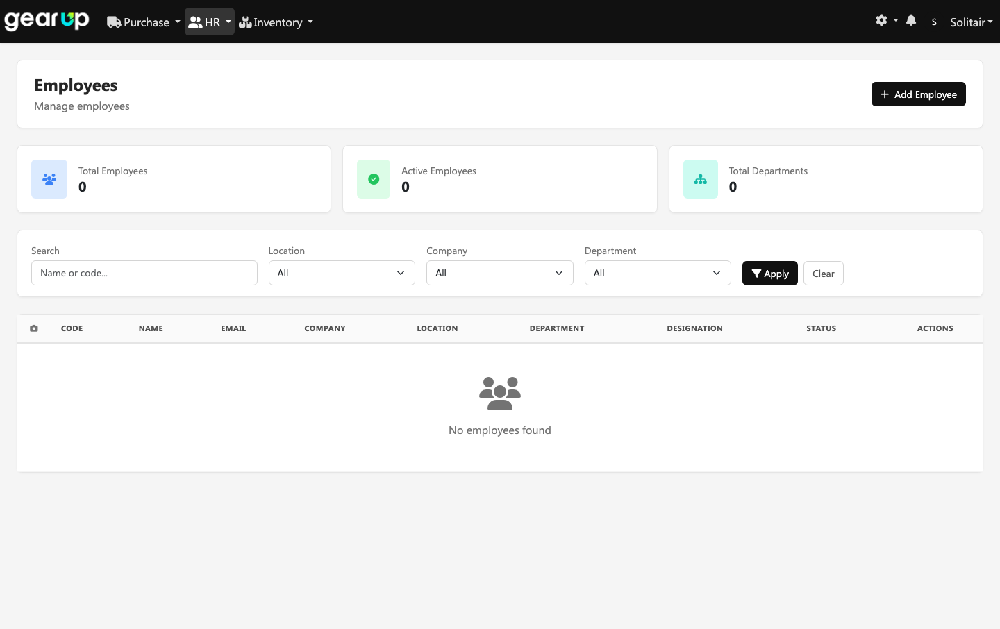

**Menu:** HR → Employees  
**URL:** `/hr/employees/`

Central employee directory.

#### How to add an employee

1. Click **Add Employee**.
2. Fill in: name, email, phone, department, designation, join date, status, salary (if used).
3. Optionally link to a **system user** for ERP login.
4. Save.

#### Employee detail page

From the list, click an employee to:

- View/edit profile and documents
- See assigned projects (if used elsewhere)
- Update employment status (active / inactive / terminated)

**Tip:** Set up **Departments** and **Designations** first so dropdowns are populated.

---

### 4.2 Departments

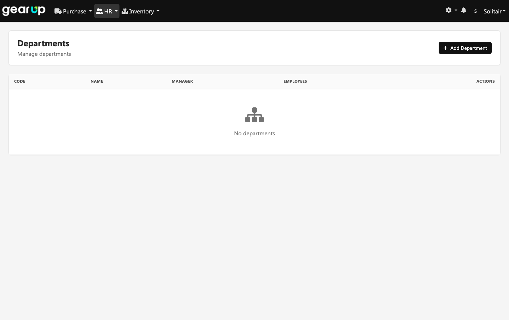

**Menu:** HR → Departments  
**URL:** `/hr/departments/`

Organizational units (e.g. Operations, Procurement, Admin).

#### How to use

1. Click **Add Department**.
2. Enter department name and optional department head.
3. Save.

Assign employees to departments when creating or editing employee records.

---

### 4.3 Designations

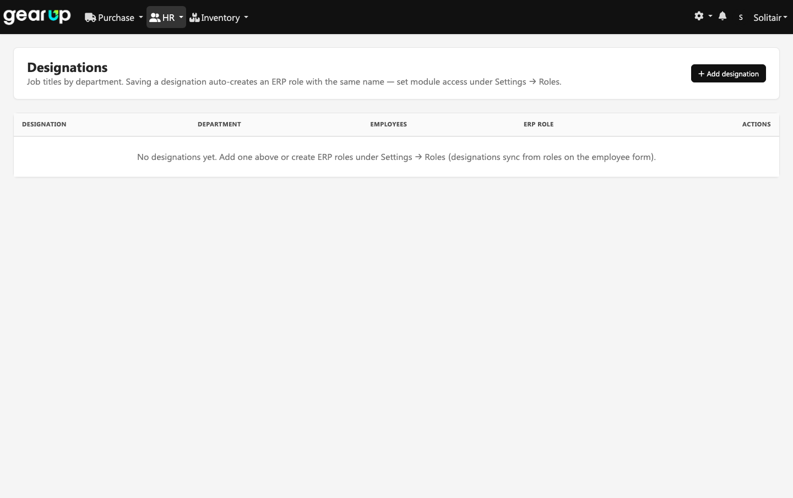

**Menu:** HR → Designations  
**URL:** `/hr/designations/`

Job titles linked to departments (e.g. Purchase Officer, Store Keeper).

#### How to use

1. Click **Add Designation**.
2. Enter title and select **Department**.
3. Save.

Use consistent designations — they appear on employee profiles and reports.

---

## 5. Inventory module

Inventory manages items, warehouses, stock levels, movements, and physical counts.

### 5.1 Items

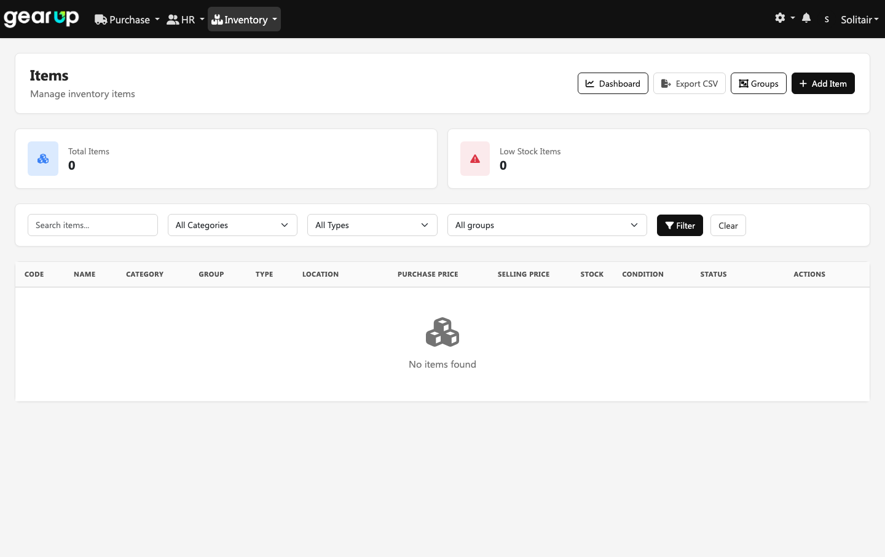

**Menu:** Inventory → Items  
**URL:** `/inventory/items/`

Master catalog of all stock and consumable items.

#### How to add an item

1. Click **+ Add Item**.
2. Enter: name, category, group, unit of measure, purchase/selling price.
3. Optionally upload an **image**.
4. Set initial stock or receive via GRN later.
5. Save.

#### List features

- **Total Items** and **Low Stock Items** summary cards
- Filter by category, type, or group
- **Export CSV** for external analysis
- **Groups** shortcut to manage item groups

---

### 5.2 Item Groups

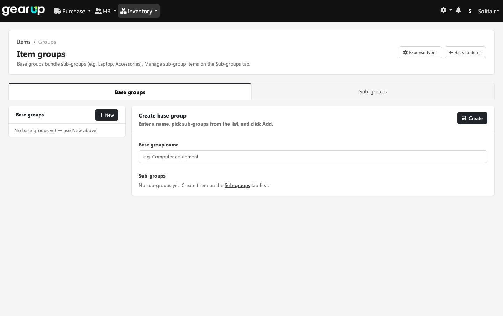

**Menu:** Inventory → Item Groups  
**URL:** `/inventory/groups/`

Group related items for reporting and ordering (e.g. "Office Supplies", "Safety Equipment").

Create groups before assigning items, or use **Groups** from the Items page.

---

### 5.3 Categories

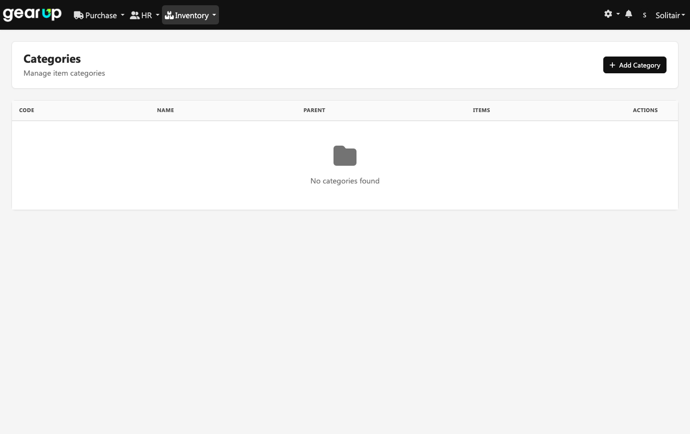

**Menu:** Inventory → Categories  
**URL:** `/inventory/categories/`

Hierarchical classification of items. Supports parent/child categories.

Use categories for filters on the Items list and inventory reports.

---

### 5.4 Warehouses

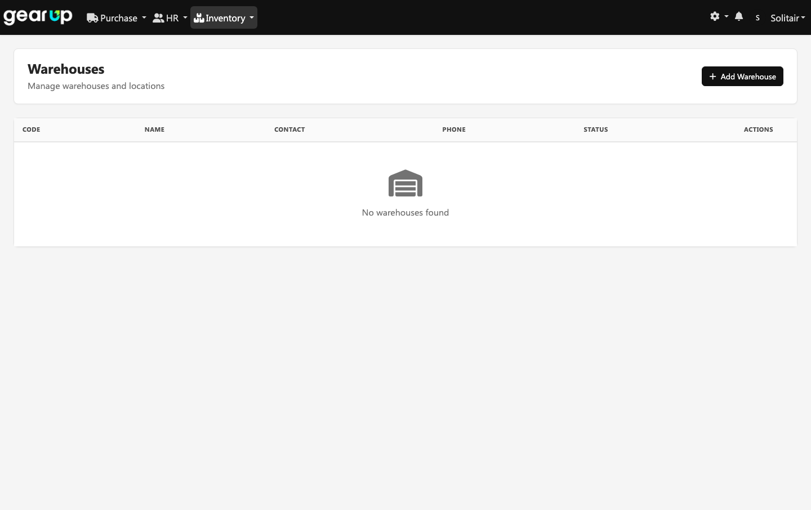

**Menu:** Inventory → Warehouses  
**URL:** `/inventory/warehouses/`

Storage locations (main store, site store, etc.).

#### How to use

1. Add each physical location as a warehouse.
2. When receiving goods (GRN) or transferring stock, specify the warehouse.
3. Stock Levels show quantity **per warehouse**.

---

### 5.5 Stock Levels

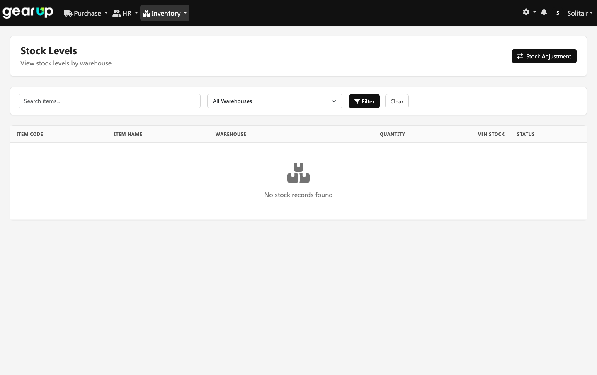

**Menu:** Inventory → Stock Levels  
**URL:** `/inventory/stock/`

Real-time on-hand quantities by item and warehouse.

#### How to use

- Review daily for **low stock** items (also flagged on Dashboard).
- Click an item to see movement history.
- Use with **Reorder / Low-Stock** report for replenishment planning.

---

### 5.6 Movements

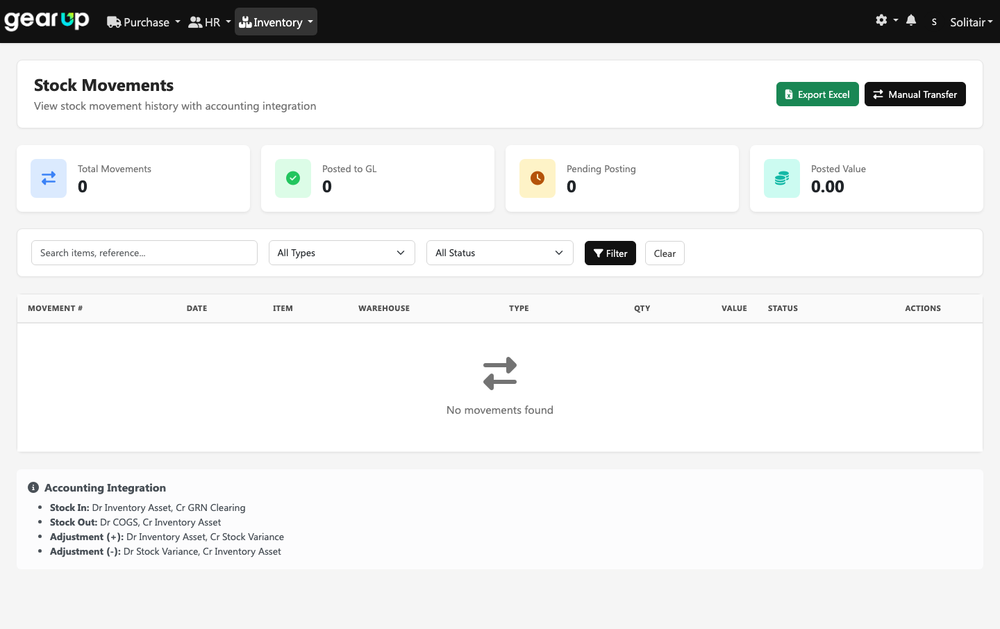

**Menu:** Inventory → Movements  
**URL:** `/inventory/movements/`

Audit trail of all stock in/out (GRN receipts, transfers, adjustments, issues).

Use this to investigate discrepancies or trace when stock changed.

---

### 5.7 Stock Transfer

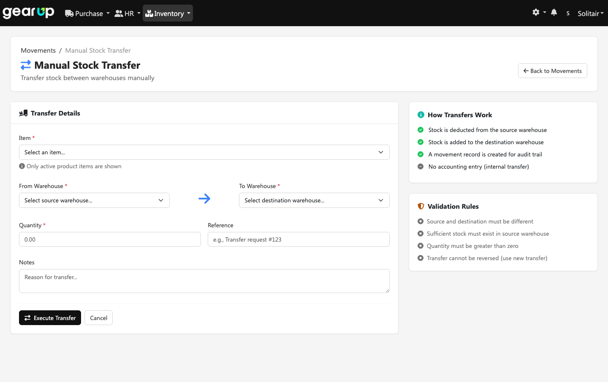

**Menu:** Inventory → Stock Transfer  
**URL:** `/inventory/transfers/`

Move stock between warehouses.

#### How to transfer

1. Create a new transfer.
2. Select **from** and **to** warehouse.
3. Add items and quantities.
4. Confirm/post the transfer.

---

### 5.8 Stock Adjustment

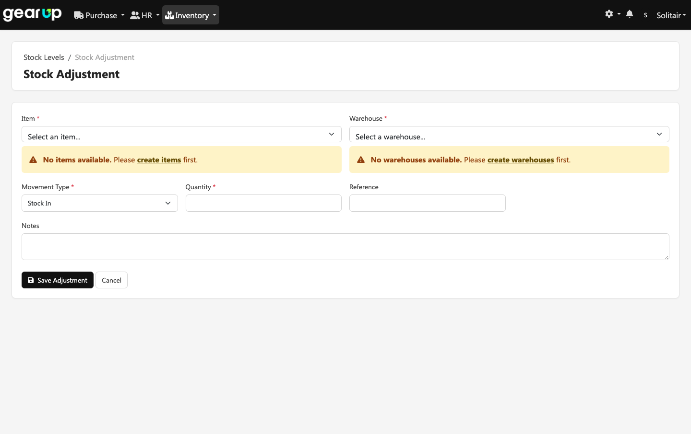

**Menu:** Inventory → Stock Adjustment  
**URL:** `/inventory/stock/adjustment/`

Correct quantities after damage, loss, or count variances.

#### How to adjust

1. Select warehouse and item.
2. Enter adjustment quantity (+ or −) and reason.
3. Save — movement is logged automatically.

**Note:** Prefer **Stock Take** for full physical counts; use adjustment for one-off corrections.

---

### 5.9 Stock Take

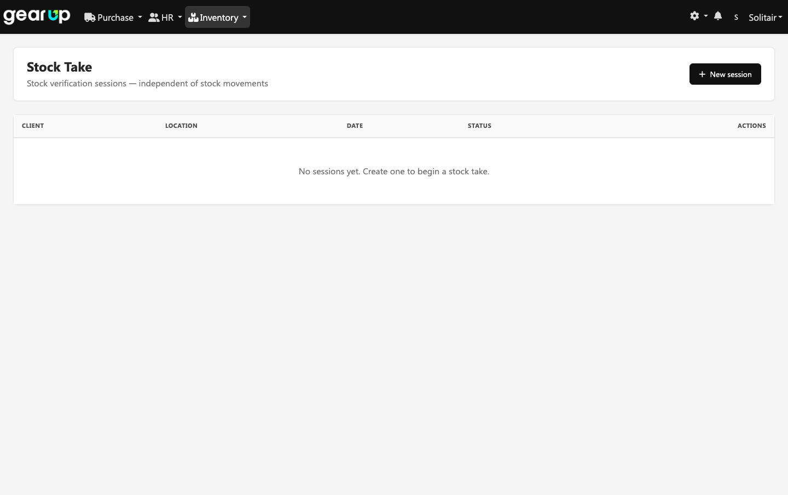

**Menu:** Inventory → Stock Take  
**URL:** `/stock-take/`

Physical inventory verification sessions.

#### How to run a stock take

1. Click **+ New session**.
2. Enter client/location and date.
3. Scan or enter counted quantities (supports barcode/camera on supported devices).
4. Complete the session — variances can be adjusted.

Stock take is **independent of stock movements** — it is a dedicated count workflow.

---

### 5.10 Inventory Reports

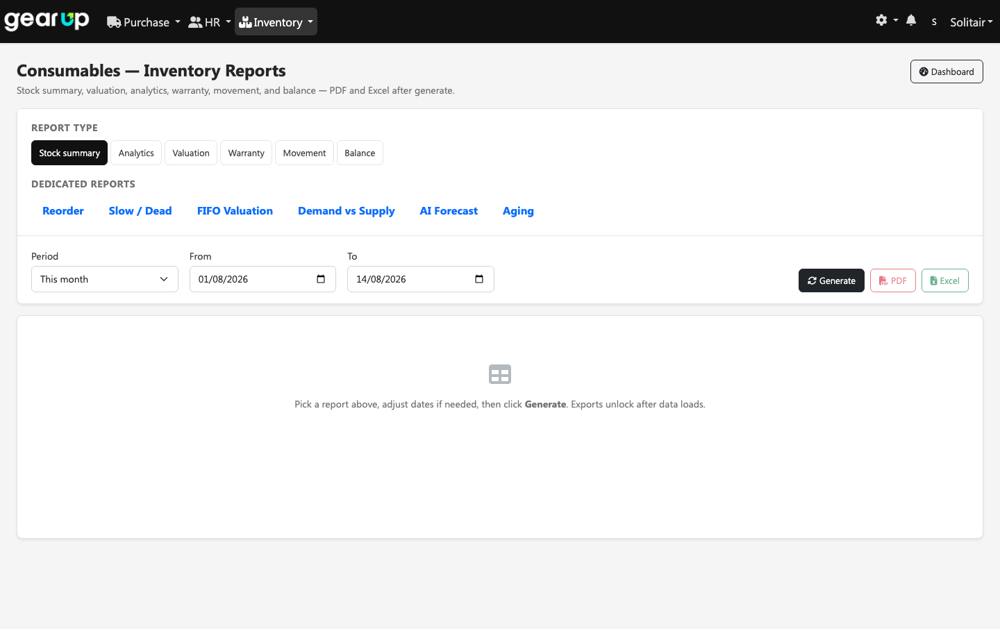

**Menu:** Inventory → Reports (flyout panel)

Available reports in Solitair:

| Report | Purpose |
|--------|---------|
| **Inventory Reports** | Hub for consumables reporting |
| **Consumables Dashboard** | Overview of consumable usage |
| **Monthly Requests / Consumption / Cost** | Period trends |
| **Inventory Aging** | How long stock has been held |
| **Reorder / Low-Stock** | Items below minimum level |
| **Slow-Moving & Dead Stock** | Obsolete or slow items |
| **FIFO Valuation** | Inventory value |
| **Demand vs Supply Gap** | Planning gaps |
| **AI Forecast Report** | AI-assisted demand forecast (requires OpenAI key) |

Open any report, set date filters if shown, and use **Export** where available.

---

## 6. Settings (Administrators)

The **Settings** gear icon is visible to **superusers** only. Regular users manage their profile from the user menu.

### 6.1 Users

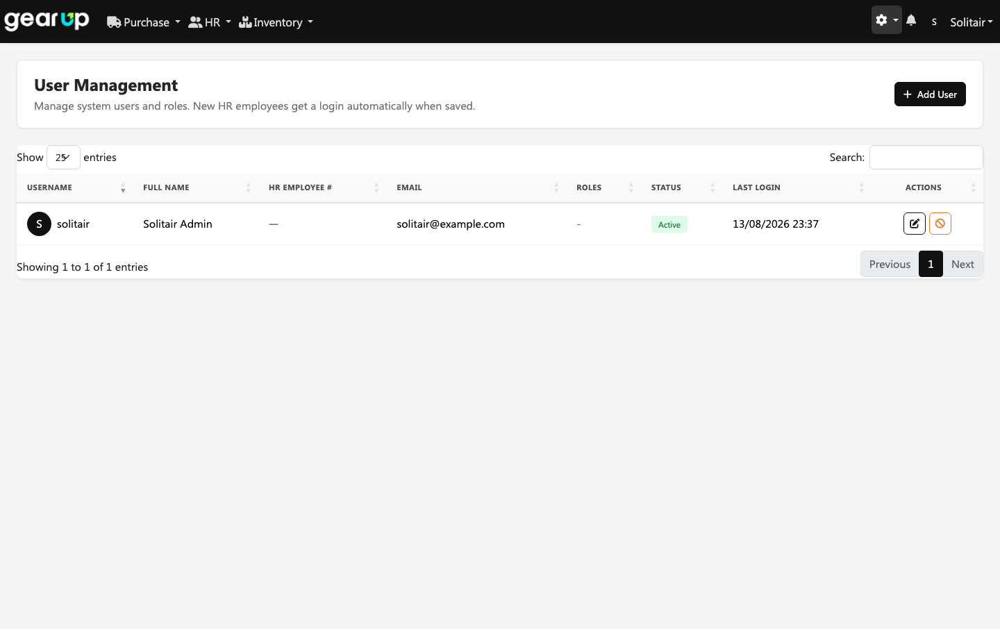

**Menu:** Settings → Users  
**URL:** `/settings/users/`

Create and manage ERP login accounts.

#### How to add a user

1. Click **Add User**.
2. Enter username, email, password, name.
3. Assign a **Role** (controls menu access).
4. Activate the account.

Deactivate users instead of deleting when someone leaves.

---

### 6.2 Roles & Permissions

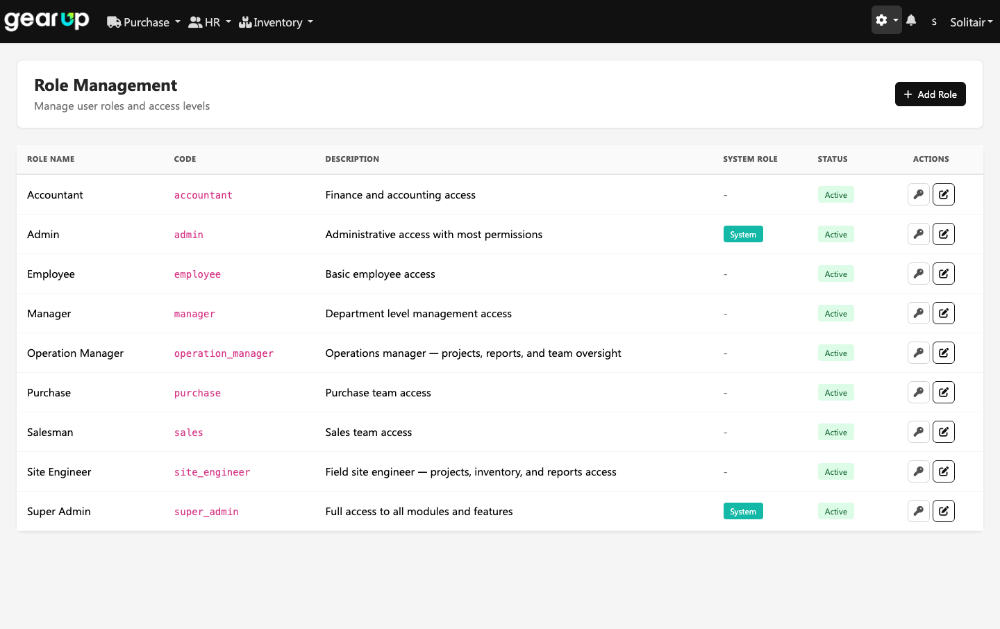

**Menu:** Settings → Roles  
**URL:** `/settings/roles/`

Define what each role can view, create, edit, delete, and approve.

#### Solitair modules in permissions

- **Purchase** (with feature toggles: vendors, PR, PO, GRN, RFQ, bills, etc.)
- **Service Request**
- **Inventory**
- **HR**
- **Settings**

Click **Permissions** on a role to open the permission matrix. Grant only what each job function needs.

---

### 6.3 Company Settings

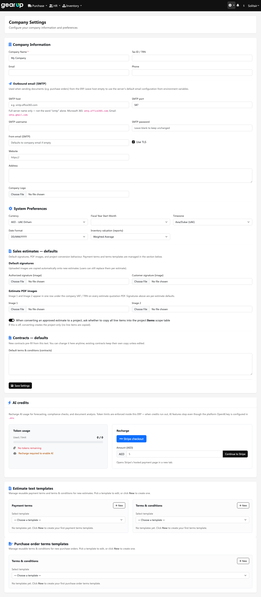

**Menu:** Settings → Company  
**URL:** `/settings/company/`

Configure:

- Company name, logo, address, phone, email, tax ID
- Currency (AED), date format, timezone
- **SMTP email** for sending POs and notifications
- Number series prefixes (PR, PO, INV, etc.)

Upload your logo here — it appears on documents and the login page.

---

### 6.4 Approval Configuration

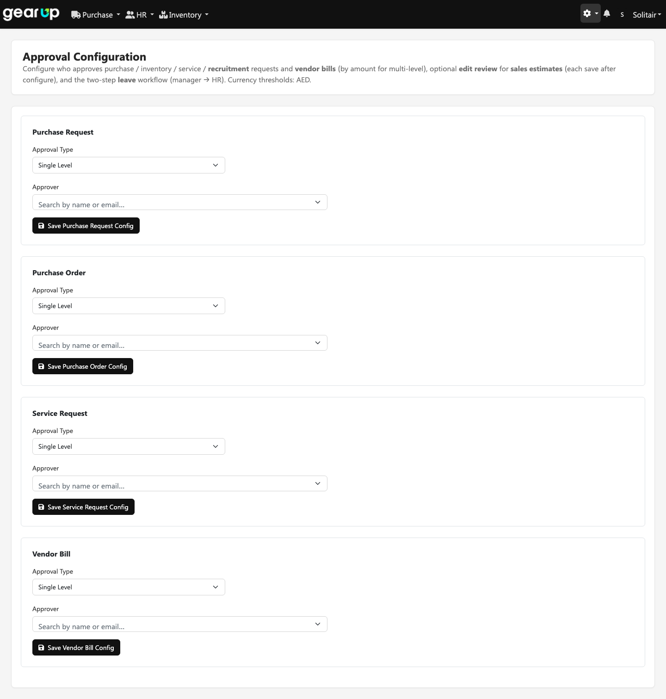

**Menu:** Settings → Approval Configuration  
**URL:** `/settings/approval-configuration/`

Set approvers for Solitair workflows:

| Document | Configuration |
|----------|---------------|
| **Purchase Request** | Single or multi-level approver |
| **Purchase Order** | Approver before PO is issued |
| **Service Request** | Approver for service work |
| **Vendor Bill** | Approver before bill is posted/paid |

For each section:

1. Choose **Approval Type** (Single Level or Multi-Level by amount).
2. Search and select the **Approver** (by name or email).
3. Click **Save … Config**.

If no approver is set, documents may **auto-approve** depending on system rules.

---

### 6.5 Request Modules

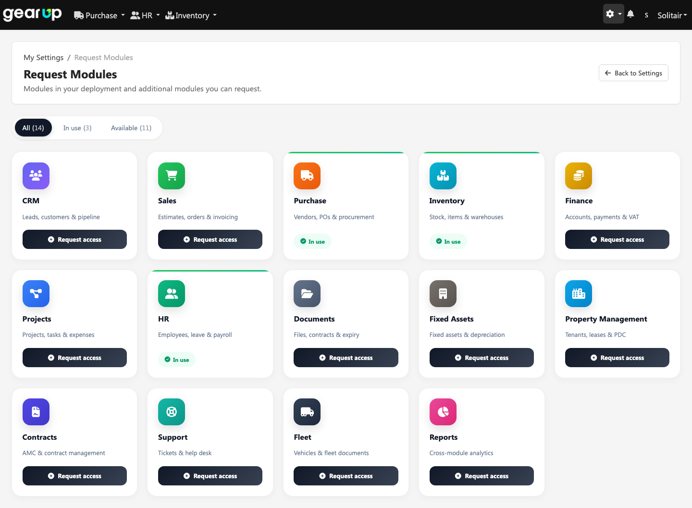

**Menu:** Settings → Request Modules  
**URL:** `/account/modules/`

Shows modules **in use** (Purchase, Inventory, HR) and modules you can **request** (CRM, Sales, Finance, Projects, etc.).

Use **Request access** to ask an administrator to enable additional ERP modules.

---

## 7. Your account

### My Profile

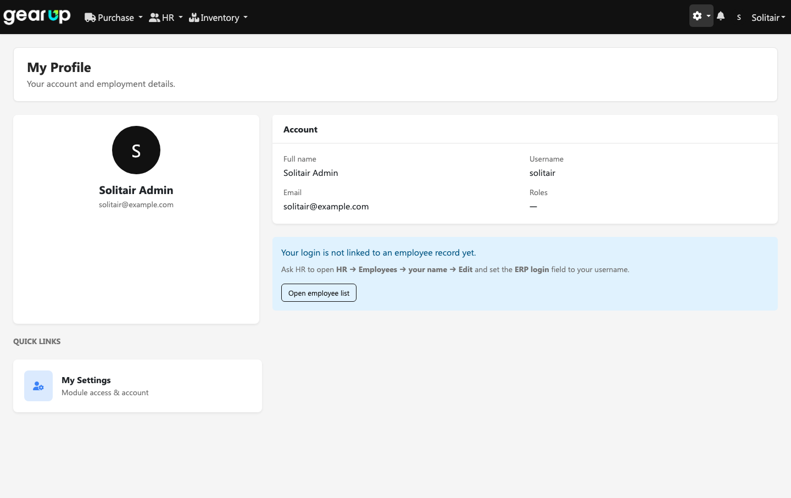

**Menu:** User menu (top right) → **My Profile**  
**URL:** `/account/profile/`

View your name, email, linked employee record, and role summary.

### My Settings

**Menu:** User menu → **My Settings**  
**URL:** `/account/`

Change password, timezone, and language preferences.

### Notifications

Click the **bell** icon to see alerts for approvals, low stock, and document updates. Click a notification to open the related record.

---

## 8. Recommended workflows

### Standard procurement (stock items)

```
1. Setup: Vendors + Inventory Items + Warehouses
2. Purchase Request (PR) → Submit → Approve
3. Convert PR → Purchase Order (PO) → Approve → Send to vendor
4. Goods Receipt (GRN) when items arrive → Stock updated
5. Vendor Bill → Match to PO/GRN → Approve → Pay
```

### Service / non-stock work

```
1. Service Request → Approve
2. Vendor Bill (or PO if applicable) → Approve
```

### New employee setup

```
1. Create Department (if new)
2. Create Designation
3. Create Employee record
4. Settings → Users → Create login + assign Role
```

### Monthly inventory review

```
1. Dashboard → check Low stock
2. Stock Levels → review quantities
3. Reports → Reorder / Aging / Slow-moving
4. Stock Take session (if physical count needed)
5. Stock Adjustment for variances
```

---

## 9. Permissions & access

- Every menu item checks your **role permissions**. If you cannot see a button or page, contact an administrator.
- **View** = see lists and details  
- **Create** = add new records  
- **Edit** = change existing records  
- **Delete** = remove records  
- **Approve** = approve PRs, POs, bills, etc.

Administrators configure permissions under **Settings → Roles → Permissions**.

---

## Screenshots

Screenshots live in `docs/user-guide/screenshots/`. To refresh them after UI changes:

```bash
pip install playwright
python -m playwright install chromium
export ERP_DOC_PASSWORD='your-password'
python docs/user-guide/capture_screenshots.py
```

---

## Need more modules?

CRM, Sales, Finance, Projects, Documents, Assets, and Reports are available in the full ERP. Use **Settings → Request Modules** to request access, or contact your system administrator.

---

*Document generated for Solitair ERP — Purchase · HR · Inventory deployment.*
